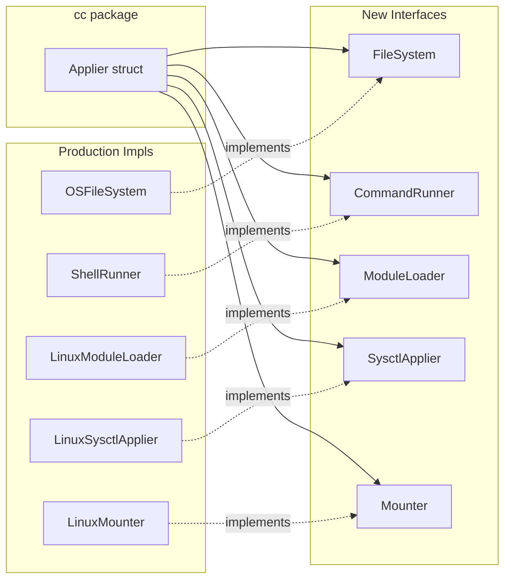

# TASK-006: Introduce Interfaces for OS-Dependent Operations

Introduce interfaces for OS-dependent operations so that `cc/funcs.go` applier functions (and their downstream packages) can be tested with mocks instead of real OS calls. This is a prerequisite for TASK-007 and TASK-008.

## User Review Required

> [!IMPORTANT]
> **Injection Pattern Choice**: This plan uses a **struct-based dependency injection** pattern (`cc.Applier` struct) rather than an options/functional-options pattern. The struct approach is simpler, more idiomatic for this codebase's style, and aligns with the existing `applier` function-type pattern. If you prefer functional options or a different DI approach, please flag it before implementation begins.

> [!IMPORTANT]
> **Scope Boundary**: This task introduces interfaces and refactors `cc/funcs.go` to accept them. It does **not** write tests for the applier functions (that's TASK-007) or for `module`/`sysctl` (that's TASK-008). It also does **not** refactor callers outside of `cc/` and `cli/config/` (e.g., `rc.go` uses raw `unix.Mount` directly and is out of scope).

> [!WARNING]
> **Public API Change**: The signatures of `RunApply`, `BootApply`, `InitApply`, and `InstallApply` will change from `func(cfg *config.CloudConfig) error` to methods on the new `Applier` struct. The call site in [config.go](file:///Users/pburns/git/k3os-bin/internal/cli/config/config.go) must be updated. No external consumers exist (all code is under `internal/`), so this is safe.

## Open Questions

> [!IMPORTANT]
> **Q1: Interface granularity for `FileWriter`** — The current code uses `os.WriteFile`, `os.MkdirAll`, `os.ReadFile`, `os.Open`, `os.Stat`, `os.Chown`, `os.Rename`, `os.Chmod`, and `os.Create` in various appliers. Should `FileWriter` be a broad `FileSystem` interface covering all file operations, or should we keep it narrow (just `WriteFile` + `MkdirAll` + `ReadFile`) and leave the remaining operations to be addressed incrementally? **This plan proposes a broad `FileSystem` interface** to maximize testability in TASK-007, but a narrower initial scope is also viable.

> [!IMPORTANT]
> **Q2: Should `hostname`, `ssh`, and `writefile` packages also accept interfaces?** — Currently `cc/funcs.go` delegates to these packages which internally call OS functions. We have two options:
>
> - **(A) Pass interfaces through**: `cc/funcs.go` passes the `FileSystem`/`CommandRunner` interfaces down to `hostname.SetHostname(cfg, fs)`, `ssh.SetAuthorizedKeys(cfg, withNet, fs)`, etc. This gives maximum testability but requires modifying those package APIs.
> - **(B) Keep delegation as-is**: Only mock at the `cc` boundary — replace the entire `hostname.SetHostname` call with a mockable interface method. Simpler but less granular testing for downstream packages.
> - **This plan proposes Option (A)** because it's needed for TASK-007's acceptance criteria ("each applier function has at least one passing and one error-case test") and for TASK-008.

## Proposed Changes

### Overview



---

### Component 1: `internal/iface` — New Interface Definitions Package

A single, shared package for all OS-abstraction interfaces. Keeping them in one place avoids circular imports and makes mock generation straightforward.

#### [NEW] [iface.go](file:///Users/pburns/git/k3os-bin/internal/iface/iface.go)

Define the following interfaces:

```go
package iface

import "os"

// FileSystem abstracts file I/O operations used by appliers.
type FileSystem interface {
    WriteFile(name string, data []byte, perm os.FileMode) error
    ReadFile(name string) ([]byte, error)
    MkdirAll(path string, perm os.FileMode) error
    Stat(name string) (os.FileInfo, error)
    Open(name string) (*os.File, error)
    Create(name string) (*os.File, error)
    CreateTemp(dir, pattern string) (*os.File, error)
    Chown(name string, uid, gid int) error
    Chmod(name string, mode os.FileMode) error
    Rename(oldpath, newpath string) error
    Remove(name string) error
    Hostname() (string, error)
}

// CommandRunner abstracts shell command execution.
type CommandRunner interface {
    Run(name string, args ...string) error
    RunWithStdin(stdin string, name string, args ...string) error
    RunShell(command string) error
}

// ModuleLoader abstracts kernel module loading.
type ModuleLoader interface {
    LoadedModules() (map[string]bool, error)
    LoadModule(name string, params string) error
}

// SysctlApplier abstracts sysctl configuration.
type SysctlApplier interface {
    Set(key string, value string) error
}

// Mounter abstracts filesystem mount operations.
type Mounter interface {
    Mount(device, target, mType, options string) error
    ForceMount(device, target, mType, options string) error
    Mounted(target string) (bool, error)
}

// HostnameSetter abstracts the syscall to set the system hostname.
type HostnameSetter interface {
    SetHostname(name string) error
}
```

> [!NOTE]
> The `FileSystem` interface uses `*os.File` for `Open`/`Create`/`CreateTemp` returns. This tightly couples to `os.File`, but is pragmatic for this codebase. If needed later, we can introduce an `io.ReadWriteCloser`-based abstraction, but that's unnecessary complexity for now.

---

### Component 2: `internal/iface/osimpl` — Production Implementations

#### [NEW] [os.go](file:///Users/pburns/git/k3os-bin/internal/iface/osimpl/os.go)

Production `FileSystem` implementation that delegates to `os.*` functions:

```go
package osimpl

import "os"

// OSFileSystem implements iface.FileSystem using real OS calls.
type OSFileSystem struct{}

func (OSFileSystem) WriteFile(name string, data []byte, perm os.FileMode) error {
    return os.WriteFile(name, data, perm)
}
func (OSFileSystem) ReadFile(name string) ([]byte, error) { return os.ReadFile(name) }
func (OSFileSystem) MkdirAll(path string, perm os.FileMode) error { return os.MkdirAll(path, perm) }
func (OSFileSystem) Stat(name string) (os.FileInfo, error) { return os.Stat(name) }
func (OSFileSystem) Open(name string) (*os.File, error) { return os.Open(name) }
func (OSFileSystem) Create(name string) (*os.File, error) { return os.Create(name) }
func (OSFileSystem) CreateTemp(dir, pattern string) (*os.File, error) {
    return os.CreateTemp(dir, pattern)
}
func (OSFileSystem) Chown(name string, uid, gid int) error { return os.Chown(name, uid, gid) }
func (OSFileSystem) Chmod(name string, mode os.FileMode) error { return os.Chmod(name, mode) }
func (OSFileSystem) Rename(oldpath, newpath string) error { return os.Rename(oldpath, newpath) }
func (OSFileSystem) Remove(name string) error { return os.Remove(name) }
func (OSFileSystem) Hostname() (string, error) { return os.Hostname() }
```

#### [NEW] [command.go](file:///Users/pburns/git/k3os-bin/internal/iface/osimpl/command.go)

Production `CommandRunner` implementation:

```go
package osimpl

import (
    "fmt"
    "os"
    "os/exec"
    "strings"
)

// ShellRunner implements iface.CommandRunner using real exec.Command calls.
type ShellRunner struct{}

func (ShellRunner) Run(name string, args ...string) error {
    cmd := exec.Command(name, args...)
    cmd.Stdout = os.Stdout
    cmd.Stderr = os.Stderr
    return cmd.Run()
}

func (ShellRunner) RunWithStdin(stdin string, name string, args ...string) error {
    cmd := exec.Command(name, args...)
    cmd.Stdin = strings.NewReader(stdin)
    cmd.Stdout = os.Stdout
    cmd.Stderr = os.Stderr
    return cmd.Run()
}

func (ShellRunner) RunShell(command string) error {
    cmd := exec.Command("sh", "-c", command)
    cmd.Stdout = os.Stdout
    cmd.Stderr = os.Stderr
    if err := cmd.Run(); err != nil {
        return fmt.Errorf("failed to run %s: %w", command, err)
    }
    return nil
}
```

#### [NEW] [module.go](file:///Users/pburns/git/k3os-bin/internal/iface/osimpl/module.go)

Production `ModuleLoader` implementation (extracts logic from `internal/module/module.go`):

```go
package osimpl

import (
    "bufio"
    "os"
    "strings"

    "pault.ag/go/modprobe"
)

// LinuxModuleLoader implements iface.ModuleLoader using /proc/modules and modprobe.
type LinuxModuleLoader struct{}

func (LinuxModuleLoader) LoadedModules() (map[string]bool, error) {
    loaded := map[string]bool{}
    f, err := os.Open("/proc/modules")
    if err != nil {
        return nil, err
    }
    defer f.Close()
    sc := bufio.NewScanner(f)
    for sc.Scan() {
        loaded[strings.SplitN(sc.Text(), " ", 2)[0]] = true
    }
    return loaded, sc.Err()
}

func (LinuxModuleLoader) LoadModule(name string, params string) error {
    return modprobe.Load(name, params)
}
```

#### [NEW] [sysctl.go](file:///Users/pburns/git/k3os-bin/internal/iface/osimpl/sysctl.go)

Production `SysctlApplier` implementation:

```go
package osimpl

import (
    "os"
    "path"
    "strings"
)

// LinuxSysctlApplier implements iface.SysctlApplier by writing to /proc/sys/.
type LinuxSysctlApplier struct{}

func (LinuxSysctlApplier) Set(key string, value string) error {
    elements := []string{"/proc", "sys"}
    elements = append(elements, strings.Split(key, ".")...)
    p := path.Join(elements...)
    return os.WriteFile(p, []byte(value), 0o644)
}
```

#### [NEW] [mount.go](file:///Users/pburns/git/k3os-bin/internal/iface/osimpl/mount.go)

Production `Mounter` implementation (wraps existing `internal/mount` package):

```go
package osimpl

import "github.com/petercb/k3os-bin/internal/mount"

// LinuxMounter implements iface.Mounter using real Linux mount syscalls.
type LinuxMounter struct{}

func (LinuxMounter) Mount(device, target, mType, options string) error {
    return mount.Mount(device, target, mType, options)
}
func (LinuxMounter) ForceMount(device, target, mType, options string) error {
    return mount.ForceMount(device, target, mType, options)
}
func (LinuxMounter) Mounted(target string) (bool, error) {
    return mount.Mounted(target)
}
```

#### [NEW] [hostname.go](file:///Users/pburns/git/k3os-bin/internal/iface/osimpl/hostname.go)

Production `HostnameSetter` implementation:

```go
package osimpl

import "syscall"

// LinuxHostnameSetter implements iface.HostnameSetter using the syscall.
type LinuxHostnameSetter struct{}

func (LinuxHostnameSetter) SetHostname(name string) error {
    return syscall.Sethostname([]byte(name))
}
```

---

### Component 3: `internal/cc` — Applier Struct with Dependency Injection

#### [MODIFY] [apply.go](file:///Users/pburns/git/k3os-bin/internal/cc/apply.go)

- Define a new `Applier` struct holding all interface dependencies
- Add a `NewApplier(...)` constructor and a `NewDefaultApplier()` factory
- Convert `RunApply`, `BootApply`, `InitApply`, `InstallApply` from package-level functions to methods on `Applier`
- Keep `runApplies` as an unexported method on `Applier`
- Preserve the `applier` function type signature

```go
// Applier holds the dependencies needed by cloud-config applier functions.
type Applier struct {
    FS       iface.FileSystem
    Cmd      iface.CommandRunner
    Modules  iface.ModuleLoader
    Sysctl   iface.SysctlApplier
    Mounter  iface.Mounter
    Hostname iface.HostnameSetter
}

// NewDefaultApplier creates an Applier with production OS implementations.
func NewDefaultApplier() *Applier {
    return &Applier{
        FS:       osimpl.OSFileSystem{},
        Cmd:      osimpl.ShellRunner{},
        Modules:  osimpl.LinuxModuleLoader{},
        Sysctl:   osimpl.LinuxSysctlApplier{},
        Mounter:  osimpl.LinuxMounter{},
        Hostname: osimpl.LinuxHostnameSetter{},
    }
}

func (a *Applier) RunApply(cfg *config.CloudConfig) error { ... }
func (a *Applier) BootApply(cfg *config.CloudConfig) error { ... }
func (a *Applier) InitApply(cfg *config.CloudConfig) error { ... }
func (a *Applier) InstallApply(cfg *config.CloudConfig) error { ... }
```

#### [MODIFY] [funcs.go](file:///Users/pburns/git/k3os-bin/internal/cc/funcs.go)

Convert all `Apply*` functions from package-level functions to methods on `*Applier`:

| Current | New |
|---------|-----|
| `func ApplyModules(cfg *config.CloudConfig) error` | `func (a *Applier) ApplyModules(cfg *config.CloudConfig) error` |
| `func ApplySysctls(cfg *config.CloudConfig) error` | `func (a *Applier) ApplySysctls(cfg *config.CloudConfig) error` |
| `func ApplyHostname(cfg *config.CloudConfig) error` | `func (a *Applier) ApplyHostname(cfg *config.CloudConfig) error` |
| `func ApplyPassword(cfg *config.CloudConfig) error` | `func (a *Applier) ApplyPassword(cfg *config.CloudConfig) error` |
| `func ApplyRuncmd(cfg *config.CloudConfig) error` | `func (a *Applier) ApplyRuncmd(cfg *config.CloudConfig) error` |
| `func ApplyBootcmd(cfg *config.CloudConfig) error` | `func (a *Applier) ApplyBootcmd(cfg *config.CloudConfig) error` |
| `func ApplyInitcmd(cfg *config.CloudConfig) error` | `func (a *Applier) ApplyInitcmd(cfg *config.CloudConfig) error` |
| `func ApplyWriteFiles(cfg *config.CloudConfig) error` | `func (a *Applier) ApplyWriteFiles(cfg *config.CloudConfig) error` |
| `func ApplySSHKeys(cfg *config.CloudConfig) error` | `func (a *Applier) ApplySSHKeys(cfg *config.CloudConfig) error` |
| `func ApplySSHKeysWithNet(cfg *config.CloudConfig) error` | `func (a *Applier) ApplySSHKeysWithNet(cfg *config.CloudConfig) error` |
| `func ApplyK3S(cfg, restart, install) error` | `func (a *Applier) ApplyK3S(cfg, restart, install) error` |
| `func ApplyK3SWithRestart(cfg) error` | `func (a *Applier) ApplyK3SWithRestart(cfg) error` |
| `func ApplyK3SInstall(cfg) error` | `func (a *Applier) ApplyK3SInstall(cfg) error` |
| `func ApplyK3SNoRestart(cfg) error` | `func (a *Applier) ApplyK3SNoRestart(cfg) error` |
| `func ApplyInstall(cfg) error` | `func (a *Applier) ApplyInstall(cfg) error` |
| `func ApplyDNS(cfg) error` | `func (a *Applier) ApplyDNS(cfg) error` |
| `func ApplyWifi(cfg) error` | `func (a *Applier) ApplyWifi(cfg) error` |
| `func ApplyDataSource(cfg) error` | `func (a *Applier) ApplyDataSource(cfg) error` |
| `func ApplyEnvironment(cfg) error` | `func (a *Applier) ApplyEnvironment(cfg) error` |

**Key refactoring details for `funcs.go`:**

- Replace `os.WriteFile(...)` → `a.FS.WriteFile(...)`
- Replace `os.ReadFile(...)` → `a.FS.ReadFile(...)`
- Replace `os.MkdirAll(...)` → `a.FS.MkdirAll(...)`
- Replace `os.Stat(...)` → `a.FS.Stat(...)`
- Replace `exec.Command(...).Run()` → `a.Cmd.Run(...)` or `a.Cmd.RunShell(...)`
- Replace `module.LoadModules(cfg)` → use `a.Modules.LoadedModules()` + `a.Modules.LoadModule()` inline
- Replace `sysctl.ConfigureSysctl(cfg)` → loop using `a.Sysctl.Set(k, v)`
- Replace `hostname.SetHostname(cfg)` → use `a.Hostname.SetHostname(...)` + `a.FS` for file writes
- Replace `command.SetPassword(...)` → `a.Cmd.RunWithStdin(...)`
- Replace `command.ExecuteCommand(...)` → loop of `a.Cmd.RunShell(...)`
- Replace `ssh.SetAuthorizedKeys(cfg, withNet)` → pass `a.FS` to a refactored `ssh.SetAuthorizedKeys`
- Replace `writefile.WriteFiles(cfg)` → pass `a.FS` and `a.Cmd` to a refactored `writefile.WriteFiles`

---

### Component 4: Downstream Package Refactoring

#### [MODIFY] [module.go](file:///Users/pburns/git/k3os-bin/internal/module/module.go)

- `LoadModules` will now accept interfaces: `func LoadModules(cfg *config.CloudConfig, loader iface.ModuleLoader) error`
- Or: the logic moves entirely into `cc/funcs.go`'s `ApplyModules` method, making `internal/module` only provide the `osimpl` types. **This plan recommends inlining the logic into `ApplyModules`** since the function is small (15 lines) and the current `module.LoadModules` is the only consumer.

#### [MODIFY] [sysctl.go](file:///Users/pburns/git/k3os-bin/internal/sysctl/sysctl.go)

- Same pattern: the loop logic moves into `ApplySysctls` using `a.Sysctl.Set(k, v)`.
- The `internal/sysctl` package retains its `ConfigureSysctl` function for backward compatibility but it is no longer called from `cc/funcs.go`.

#### [MODIFY] [hostname.go](file:///Users/pburns/git/k3os-bin/internal/hostname/hostname.go)

- Refactor `SetHostname` to accept `iface.FileSystem` and `iface.HostnameSetter`:

  ```go
  func SetHostname(c *config.CloudConfig, hs iface.HostnameSetter, fs iface.FileSystem) error
  ```

- Replace `syscall.Sethostname(...)` → `hs.SetHostname(...)`
- Replace `os.WriteFile(...)` → `fs.WriteFile(...)`
- Replace `os.Open(...)` → `fs.Open(...)`
- Replace `os.Hostname()` → `fs.Hostname()`

#### [MODIFY] [ssh.go](file:///Users/pburns/git/k3os-bin/internal/ssh/ssh.go)

- Refactor `SetAuthorizedKeys` to accept `iface.FileSystem`:

  ```go
  func SetAuthorizedKeys(cfg *config.CloudConfig, withNet bool, fs iface.FileSystem) error
  ```

- Replace `os.ReadFile`, `os.Stat`, `os.Mkdir`, `os.Chown`, `os.Create` → `fs.*`
- Replace `util.WriteFileAtomic(...)` → implement using `fs.CreateTemp` + `fs.WriteFile` + `fs.Chmod` + `fs.Rename`

#### [MODIFY] [writefile.go](file:///Users/pburns/git/k3os-bin/internal/writefile/writefile.go)

- Refactor `WriteFiles` and `WriteFile` to accept `iface.FileSystem` and `iface.CommandRunner`:

  ```go
  func WriteFiles(cfg *config.CloudConfig, fs iface.FileSystem)
  func WriteFile(f *config.File, root string, fs iface.FileSystem, cmd iface.CommandRunner) (string, error)
  ```

- Replace `os.CreateTemp`, `os.WriteFile`, `os.Chmod`, `os.Rename` → `fs.*`
- Replace `exec.Command("chown", ...)` → `cmd.Run("chown", ...)`

#### [MODIFY] [command.go](file:///Users/pburns/git/k3os-bin/internal/command/command.go)

- `ExecuteCommand` and `SetPassword` remain available for any direct callers outside `cc/`, but `cc/funcs.go` will use `a.Cmd` instead.
- No signature changes needed for backward compatibility.

---

### Component 5: CLI Caller Update

#### [MODIFY] [config.go](file:///Users/pburns/git/k3os-bin/internal/cli/config/config.go)

Update the `Main()` function to instantiate a default `Applier`:

```go
func Main() error {
    cfg, err := config.ReadConfig()
    if err != nil {
        return err
    }

    applier := cc.NewDefaultApplier()

    if initrd {
        return applier.InitApply(&cfg)
    } else if bootPhase {
        return applier.BootApply(&cfg)
    } else if installPhase {
        return applier.InstallApply(&cfg)
    } else if dump {
        return config.Write(cfg, os.Stdout)
    } else if dumpJSON {
        return json.NewEncoder(os.Stdout).Encode(&cfg)
    }

    return applier.RunApply(&cfg)
}
```

---

### Files Not Modified (Out of Scope)

| File | Reason |
|------|--------|
| [rc.go](file:///Users/pburns/git/k3os-bin/internal/cli/rc/rc.go) | Uses raw `unix.Mount` directly, not via the `mount` package or `cc` appliers. Refactoring `rc.go` is a separate task. |
| [mount.go](file:///Users/pburns/git/k3os-bin/internal/mount/mount.go) | The existing `Mount`/`ForceMount`/`Mounted` functions remain unchanged. The `LinuxMounter` wrapper delegates to them. |
| [enterchroot/](file:///Users/pburns/git/k3os-bin/internal/enterchroot) | Uses `mount` directly for boot-path code. Out of scope (system-level, Linux-only). |
| [main.go](file:///Users/pburns/git/k3os-bin/main.go) | Uses `mount.Mount` for root remount. Out of scope. |
| [system/component.go](file:///Users/pburns/git/k3os-bin/internal/system/component.go) | Uses `mount.ForceMount` for remount. Out of scope. |

---

## Implementation Checklist

1. [ ] Create `internal/iface/iface.go` — all interface definitions
2. [ ] Create `internal/iface/osimpl/os.go` — `OSFileSystem` production impl
3. [ ] Create `internal/iface/osimpl/command.go` — `ShellRunner` production impl
4. [ ] Create `internal/iface/osimpl/module.go` — `LinuxModuleLoader` production impl
5. [ ] Create `internal/iface/osimpl/sysctl.go` — `LinuxSysctlApplier` production impl
6. [ ] Create `internal/iface/osimpl/mount.go` — `LinuxMounter` production impl
7. [ ] Create `internal/iface/osimpl/hostname.go` — `LinuxHostnameSetter` production impl
8. [ ] Modify `internal/cc/apply.go` — add `Applier` struct, constructor, convert phase functions to methods
9. [ ] Modify `internal/cc/funcs.go` — convert all `Apply*` to `Applier` methods, replace OS calls with interface calls
10. [ ] Modify `internal/hostname/hostname.go` — accept `iface.HostnameSetter` + `iface.FileSystem`
11. [ ] Modify `internal/ssh/ssh.go` — accept `iface.FileSystem`
12. [ ] Modify `internal/writefile/writefile.go` — accept `iface.FileSystem` + `iface.CommandRunner`
13. [ ] Modify `internal/cli/config/config.go` — use `cc.NewDefaultApplier()`
14. [ ] Ensure all existing functionality continues to work unchanged (build + existing tests pass)
15. [ ] Run `golangci-lint run ./...` and fix any issues

## Verification Plan

### Automated Tests

```bash
# Build the project (must compile cleanly — this is a Linux-only project)
docker run --rm -v "$(pwd)":/app -w /app golang:1.21.9-bookworm \
  sh -c 'CGO_ENABLED=0 go build -o /dev/null .'

# Run all existing tests (must all pass — no behavioral changes)
docker run --rm -v "$(pwd)":/app -w /app golang:1.21.9-bookworm \
  go test -race -covermode=atomic -failfast ./...

# Run linter
docker run --rm -v "$(pwd)":/app -w /app golang:1.21.9-bookworm \
  sh -c 'go install github.com/golangci/golangci-lint/v2/cmd/golangci-lint@latest && golangci-lint run ./...'

# Verify no import cycles
docker run --rm -v "$(pwd)":/app -w /app golang:1.21.9-bookworm \
  go vet ./...
```

### Manual Verification

- Confirm that `NewDefaultApplier()` wires all production implementations correctly by reviewing the constructor
- Confirm that all interface methods match the signatures used by their callers (compile-time check)
- Verify no circular import between `internal/iface` → `internal/mount` → `internal/iface` (the `osimpl` sub-package breaks the cycle)
